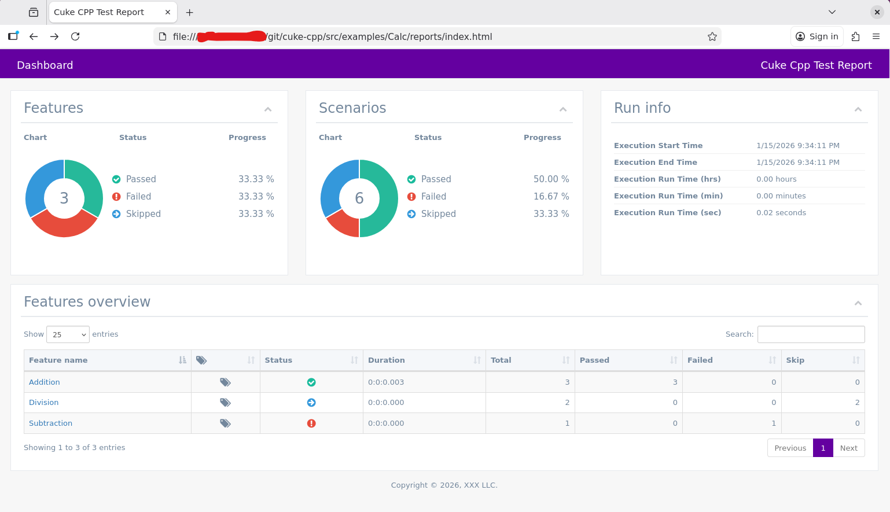

# cuke-cpp
cuke-cpp: A streamlined C++ Behavior-Driven Development (BDD) framework designed for high-performance environments. It optimizes the testing workflow by unifying the Gherkin parser and Cucumber server within a single executable, effectively eliminating the architectural overhead and complex wiring layers found in traditional cucumber-cpp implementations.

## Report Format

### Console ouputs

### Json file

### Html files
