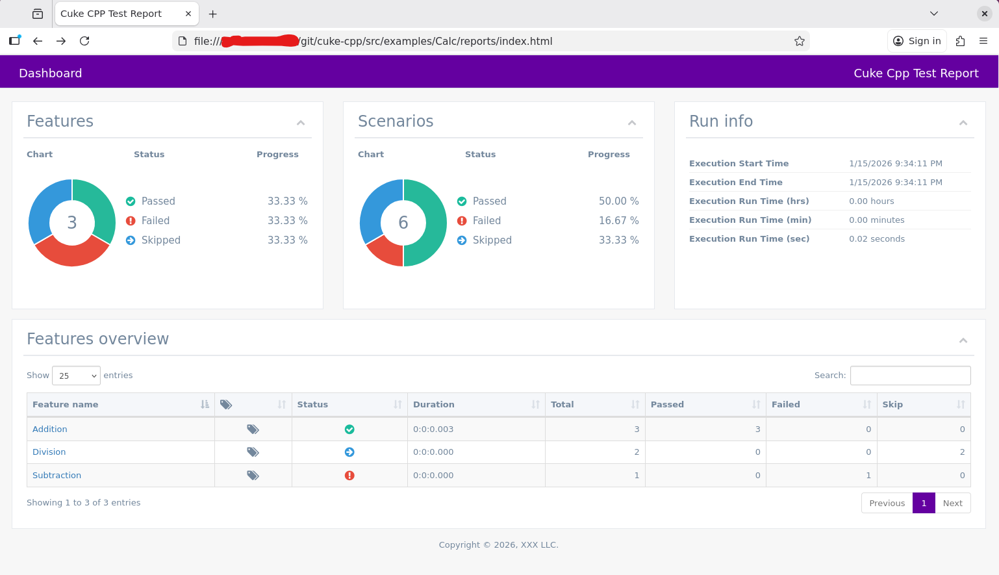

# cuke-cpp

cuke-cpp is a streamlined C++ Behavior-Driven Development (BDD) framework that brings the Cucumber workflow into a single native executable. It removes the Ruby dependency and bundles parsing, tag evaluation, and reporting into a fast, portable C++ toolchain.

## Why cuke-cpp

Compared to the original cucumber-cpp, this project adds a set of native, zero-Ruby enhancements:

- No Ruby runtime dependency or glue process.
- Native C++ tag expressions.
- Native Cucumber Expressions.
- Custom parameter types in C++.
- Pretty HTML reports out of the box.
- Unified runner that embeds the Gherkin parser and server.

## Architecture at a glance

The runner is a single binary that:

1. Discovers and parses feature files.
2. Evaluates tag expressions natively.
3. Matches steps using Cucumber Expressions.
4. Resolves custom parameter types.
5. Executes step definitions.
6. Emits console, JSON, and HTML reports.

## Quick start

### Build

```bash
cmake -S . -B build
cmake --build build
```

### Run

```bash
./build/bin/cuke-cpp --feature examples/Calc/features
```

Tip: The calculator sample provides a complete workflow, including custom parameter types and HTML reports. See [examples/Calc/README.txt](examples/Calc/README.txt).

## Usage

### Basic options

```bash
./build/bin/cuke-cpp \
	--feature <path-to-feature-or-dir> \
	--tags "@smoke and not @wip" \
	--json \
	--html \
	--verbose
```

Notes:

- `--feature` accepts a single feature file or a directory; directories are scanned recursively for `.feature` files.
- You can pass multiple paths after `--feature` until the next option begins.
- `--verbose` enables the console report.

### Tag expressions (native C++)

Tag expressions follow the standard Cucumber syntax:

- `@smoke`
- `@smoke and @fast`
- `@smoke and not @wip`
- `@a or @b`

You can pass multiple tag expressions after `--tags`. Each expression is parsed separately, and all expressions must pass for a scenario to run.

### Cucumber Expressions (native C++)

Use Cucumber Expressions to match steps with readable placeholders:

- `Given I add {int} and {int}`
- `Then the result should be {int}`

### Custom parameter types

Define parameter types in C++ for domain-specific parsing, then use them in expressions like `{money}` or `{date}`. See the calculator example for a working configuration: [examples/Calc](examples/Calc).

## Report formats

### Console output

Human-friendly, colored output optimized for CI and local development.

### JSON report

Machine-readable JSON output compatible with standard Cucumber tooling.

Generated file: `./reports/cuke_report.json` (relative to the current working directory).

### HTML report

Clean, navigable HTML report with summary, scenario details, and step results.

Generated files: `./reports/index.html` plus one HTML file per feature.

The HTML reporter reads templates from `./templates`. In the Calc example, run from [examples/Calc](examples/Calc) so the templates and assets resolve correctly.



## Project layout

- Core sources live in [src/lib](src/lib).
- The CLI entry point is in [src/lib/main.cpp](src/lib/main.cpp).
- The sample project is in [examples/Calc](examples/Calc).

## Calc example structure

The Calc example shows a complete end-to-end setup, including custom parameter types and HTML reports.

- [examples/Calc/features](examples/Calc/features) contains `.feature` files and a `step_definitions` folder with C++ step implementations.
- [examples/Calc/src](examples/Calc/src) holds a small calculator library used by the steps.
- [examples/Calc/custom_parameter_types.json](examples/Calc/custom_parameter_types.json) defines custom parameter types used in Cucumber Expressions.
- [examples/Calc/templates](examples/Calc/templates) provides HTML templates and assets for report generation.
- [examples/Calc/reports](examples/Calc/reports) shows sample JSON and HTML report outputs.

## Using cuke-cpp with Calc

Run all Calc features:

```bash
cd examples/Calc
../../build/bin/cuke-cpp --feature features --verbose
```

Generate a JSON report:

```bash
cd examples/Calc
../../build/bin/cuke-cpp --feature features --json
```

Generate an HTML report:

```bash
cd examples/Calc
../../build/bin/cuke-cpp --feature features --html
```

Filter by tag expressions:

```bash
cd examples/Calc
../../build/bin/cuke-cpp --feature features --tags "@smoke and not @wip" --verbose
```

Select specific feature files:

```bash
cd examples/Calc
../../build/bin/cuke-cpp --feature features/addition.feature features/division.feature --verbose
```

## Differences from cucumber-cpp

This project keeps the BDD workflow but removes the cross-language glue layer. The result is faster startup, simpler deployment, and a fully native C++ stack. If you are migrating from cucumber-cpp, you can keep your Gherkin features and step logic while adopting native expressions, tags, and reporting.

## Dependencies

This project uses CMake and depends on these libraries:

- [cucumber-gherkin](https://github.com/cucumber/gherkin/tree/main/cpp) (C++ Gherkin parser)
- [cucumber-cpp](https://github.com/hs515/cucumber-cpp) (Updated C++ step definition framework)
- [cucumber-tag-expressions](https://github.com/hs515/tag-expressions/tree/cpp-tag-expressions) (native tag expression parser)
- [nlohmann-json](https://github.com/nlohmann/json) (C++ json parsing)

You can provide these via your system package manager or enable FetchContent by setting `CUKE_CPP_FETCH_DEPS=ON` when configuring.

## Contributing

Issues and pull requests are welcome. If you plan a larger change, please open an issue to discuss the approach first.